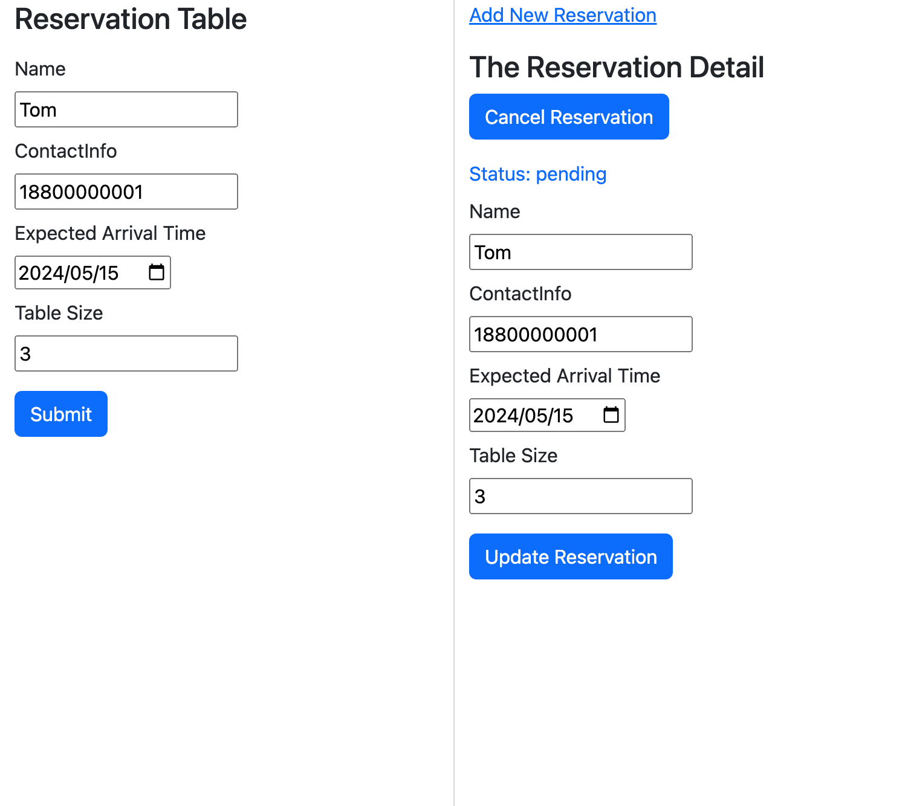
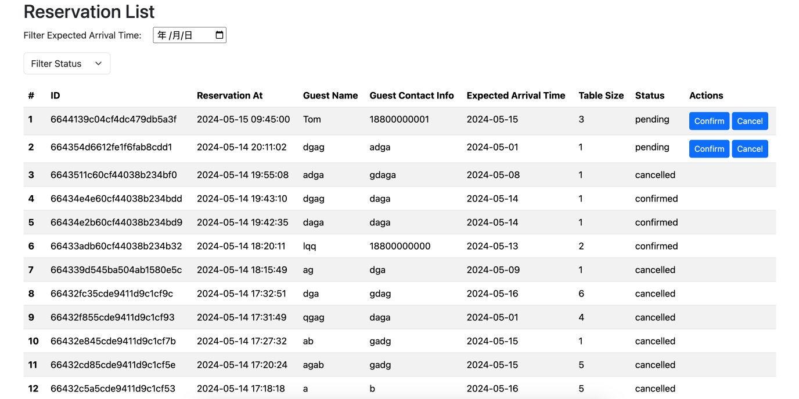

# Reservation System

## Development

### Backend

Ensure MongoDB is installed and running at `mongodb://localhost:27017/`. Or pass MONGO_URI env when start.

```bash
cd backend
npm install
npm run start:dev
```

### Frontend

```bash
cd frontend
npm install
npm run dev
```

## Tech Stack

### Backend

- MongoDB
- Nest.js
- TypeScript

Nest.js framework built on TypeScript, offers a modular and scalable architecture, ideal for complex applications. With support for both RESTful API and GraphQL endpoints, it enables clean code and clear architecture through its modular structure and dependency injection.

MongoDB is chosen as the database for its flexibility, scalability, and support for document-oriented data models, seamlessly integrating with Nest.js.

### Frontend

- React
- Vite

## Project Structure

- RESTful API for guest interactions
- GraphQL for employee interactions

Guest interactions with the backend utilize RESTful API, while restaurant operations leverage GraphQL API.

This design provides flexibility in interface selection, catering to different user needs:

- RESTful API simplifies guest interactions with standard HTTP methods.
- GraphQL empowers restaurant employees with advanced querying and mutation capabilities, ensuring precise data retrieval as needed.

## Test Report

### Run Test

```bash
cd backend
npm run test
npm run test:e2e
```

### Test Coverage

```bash
cd backend
npm run test:cov
```

```
-----------------------------|---------|----------|---------|---------|----------------------------------
File                         | % Stmts | % Branch | % Funcs | % Lines | Uncovered Line #s
-----------------------------|---------|----------|---------|---------|----------------------------------
All files                    |   48.53 |       15 |   35.48 |   48.96 |
 src                         |   17.07 |        0 |   16.66 |   14.28 |
  app.module.ts              |       0 |        0 |       0 |       0 | 1-34
  app.service.ts             |       0 |      100 |       0 |       0 | 1-6
  main.ts                    |       0 |      100 |       0 |       0 | 1-10
  validation.pipe.ts         |   43.75 |        0 |   33.33 |   35.71 | 14-17,26-33
 src/reservations            |   58.46 |       20 |      40 |      60 |
  reservation.dto.ts         |    92.3 |      100 |       0 |    90.9 | 11
  reservation.model.ts       |     100 |      100 |     100 |     100 |
  reservations.controller.ts |   44.82 |        0 |      20 |   45.83 | 30-32,40-41,50-52,57-61
  reservations.module.ts     |       0 |      100 |     100 |       0 | 1-17
  reservations.resolver.ts   |   38.09 |        0 |   16.66 |   38.88 | 15,20-26,30-35,41-46,50-60,64-68
  reservations.service.ts    |   89.47 |    33.33 |     100 |   93.75 | 28
-----------------------------|---------|----------|---------|---------|----------------------------------
```

## Screenshot

### Guest



### Employee


